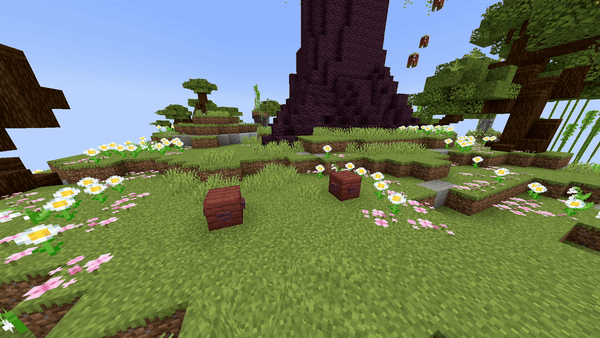

import Tabs from '@theme/Tabs';
import TabItem from '@theme/TabItem';

# Block Line

## Parameters

| Parameter        | Information                                                                                                                  | Example                    |
|------------------|------------------------------------------------------------------------------------------------------------------------------|----------------------------|
| **FromLocation** | The start location of the fountain in the format of `world, x, y, z`.                                                        | `world, 196.3, 64, -381.8` |
| **ToLocation**   | The location it moves towards in the format of `world, x, y, z`.                                                             | `world, 201.3, 64, -381.8` |
| **Block**        | The [block](https://hub.spigotmc.org/javadocs/bukkit/org/bukkit/Material.html) to use as falling block. Items will not work! | `BLUE_STAINED_GLASS`       |
| **BlockData**    | The [block data](https://minecraft.wiki/w/Block_states) of the block (if it has any). Use `[]` to set none.                  | `[open=true]`              |
| **Speed**        | The speed the origin moves from the first location to the second one. Measured in `blocks/s`.                                | `5`                        |
| **Duration**     | The amount of ticks each block will stay.                                                                                    | `40`                       |
| **Delay**        | The amount of ticks this effect waits after the show starts before its activation.                                           | `40`                       |

<details>
<summary>YAML Preset</summary>

```yaml
'1':
  Type: BLOCK_LINE
  FromLocation: world, 0, 0, 0
  ToLocation: world, 0, 3, 0
  Block: BLUE_STAINED_GLASS
  BlockData: []
  Speed: 1
  Duration: 40
  Delay: 0
```

</details>

## Preview



## YouTube Tutorial

*Doesn't exist yet.*