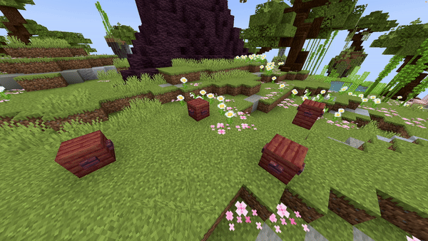

# Block Path

## Parameters

| Parameters     | Information                                                                                                                                                                                                                           | Example                                                          |
|----------------|---------------------------------------------------------------------------------------------------------------------------------------------------------------------------------------------------------------------------------------|------------------------------------------------------------------|
| **Path**       | The path the origin of the fountain follows using the format of `world, x1, y1, z1; x2, y2, z2; x3, y3, z3`. You can of course repeat this process as much as you would like. **Use a `;` to separate different locations**.          | `world, 196.3, 64, -381.8; 199.3, 65, -375.8; 205.8, 61, -361.8` |
| **Block**      | The [block](https://hub.spigotmc.org/javadocs/bukkit/org/bukkit/Material.html) to use as falling block. Items will not work!                                                                                                          | `BLUE_STAINED_GLASS`                                             |
| **BlockData**  | The [block data](https://minecraft.wiki/w/Block_states) of the block (if it has any). For example an open gate, a rotated stair, ... Use `[]` to set none.                                                                            | `[open=true]`                                                    |
| **Speed**      | The speed the origin moves over the path. Measured in `blocks/s`.                                                                                                                                                                     | `5`                                                              |
| **Duration**   | The amount of ticks each block will stay.                                                                                                                                                                                             | `40`                                                             |
| **SplineType** | The spline type which will be used for the path. This can be `POLY_CHAIN` for straight lines, `BEZIER` for extremely smooth lines which don't go over the exact points or `CATMULL_ROM` for smooth lines which do go over the points. | `CATMULL_ROM`                                                    |
| **Delay**      | The amount of ticks this effect waits after the show starts before its activation.                                                                                                                                                    | `40`                                                             |

<details>
<summary>YAML Preset</summary>

```yaml
'1':
  Type: BLOCK_PATH
  Path: 'world, 0, 0, 0; 3, 3, 3' 
  Block: BLUE_STAINED_GLASS
  BlockData: []
  Speed: 1
  Duration: 40
  SplineType: POLY_CHAIN
  Delay: 0
```

</details>

## Preview



## YouTube Tutorial

*Doesn't exist yet.*
