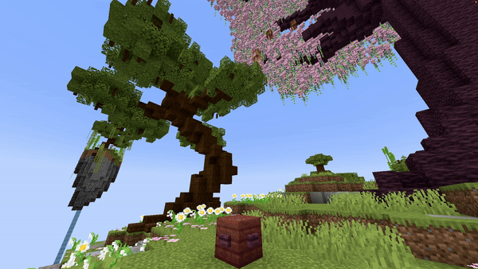

# Falling Block

## Parameters

| Parameter     | Information                                                                                                                                   | Example                    |
|---------------|-----------------------------------------------------------------------------------------------------------------------------------------------|----------------------------|
| **Location**  | The location to spawn the falling block in the format of `world, x, y, z`.                                                                    | `world, 196.5, 64, -381.5` |
| **Velocity**  | Sets the velocity of falling blocks to launch them in a specific direction. Values should not be too high (max around 10). Format: `x, y, z`. | `0.5, 1.3, 0`              |
| **Block**     | The [block](https://hub.spigotmc.org/javadocs/bukkit/org/bukkit/Material.html) to use as falling block. Items will not work!                  | `STONE`                    |
| **BlockData** | The [block data](https://minecraft.wiki/w/Block_states) of the block if applicable (e.g. open gate, rotated stair). Use `[]` for none.        | `[open=true]`              |
| **Delay**     | The amount of ticks this effect waits after the show starts before its activation.                                                            | `40`                       |

<details>
<summary>YML Preset</summary>

```yaml
'1':
Type: FALLING_BLOCK
Location: world, 0, 0, 0
Velocity: 0, 0, 0
Block: STONE
BlockData: []
Delay: 0
```

</details>

## Preview



## YouTube Tutorial

<iframe width="560" height="315" src="https://www.youtube.com/embed/nDk6b2ZV6wE" title="YouTube video player" frameborder="0" allow="accelerometer; autoplay; clipboard-write; encrypted-media; gyroscope; picture-in-picture" allowfullscreen></iframe>
