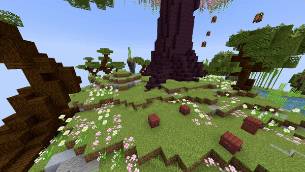

# Fountain Dancing

## Parameters

| Parameters      | Information                                                                                                                                                                                                                                                                                   | Example                                                                                                                   |
|-----------------|-----------------------------------------------------------------------------------------------------------------------------------------------------------------------------------------------------------------------------------------------------------------------------------------------|---------------------------------------------------------------------------------------------------------------------------|
| **Location**    | The origin of the fountain in the format `world, x, y, z`.                                                                                                                                                                                                                                    | `world, 196.3, 64, -381.8`                                                                                                |
| **Sequencer**   | Edit the velocity of the fountain over time. Format: `ticks: width, height, depth`. Multiple values can be added separated by semicolons: `ticks1: width1, height1, depth1; ticks2: width2, height2, depth2; ...`. See the hint below for details on automatic values and changing materials. | `0: 0.0, 0.0, 0.0; 25: 0.0, 0.75, 0.0; 50: 0.3, 0.75, 0.0; 75: 0.0, 0.75, 0.0; 100: -0.3, 0.75, 0.0; 125: 0.0, 0.75, 0.0` |
| **Block**       | The [block](https://hub.spigotmc.org/javadocs/bukkit/org/bukkit/Material.html) to use as falling block (items won't work).                                                                                                                                                                    | `BLUE_STAINED_GLASS`                                                                                                      |
| **BlockData**   | The [block data](https://minecraft.wiki/w/Block_states) of the block (if it has any), e.g. an open gate or rotated stair. Use `[]` to set none.                                                                                                                                               | `[open=true]`                                                                                                             |
| **Duration**    | The duration of the effect in ticks.                                                                                                                                                                                                                                                          | `20`                                                                                                                      |
| **Randomizer**  | Randomizes velocity values slightly. Higher values create more variation. Recommended range: `0` to `1`.                                                                                                                                                                                      | `0.5`                                                                                                                     |
| **Delay**       | Number of ticks the effect waits after the show starts before activation.                                                                                                                                                                                                                     | `40`                                                                                                                      |

<details>
<summary>YML Preset</summary>

```yaml
'1':
  Type: FOUNTAIN_DANCING
  Location: 'world, 0, 0, 0'
  Sequencer: '0: 0.0, 0.0, 0.0; 25: 0.0, 0.75, 0.0; 50: 0.3, 0.75, 0.0; 75: 0.0, 0.75, 0.0; 100: -0.3, 0.75, 0.0; 125: 0.0, 0.75, 0.0'
  Block: BLUE_STAINED_GLASS
  BlockData: []
  Duration: 20
  Randomizer: 0
  Delay: 0
```

</details>

## Preview



---

<details>
<summary>Sequencer Additional Information</summary>
:::info

### Sequencer Additional Information

The sequencer format is:

```
tick: width, height, depth; tick: width, height, depth; ...
```

**Advanced usage:**

* **Automatic values:** Use `~` to let the plugin calculate the value automatically.

  Example:

  ```
  0: 0.0, 0.0, 0.0;
  50: ~, 0.75, 0.2;
  100: 0.3, ~, -0.2;
  ```

* **Changing materials:** Add a material name as a fourth value to change the block used at that tick.

  Example:

  ```
  0: 0.0, 0.0, 0.0, RED_WOOL;
  50: ~, ~, ~, YELLOW_WOOL;
  100: 0.3, 0.75, 0.3, ORANGE_WOOL;
  ```

:::
</details>