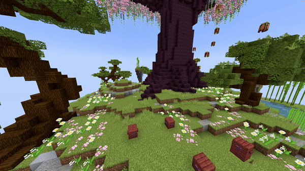

# Fountain Line

## Parameters

| Parameters       | Information                                                                                                                                                                                                                                                                      | Example                    |
|------------------|----------------------------------------------------------------------------------------------------------------------------------------------------------------------------------------------------------------------------------------------------------------------------------|----------------------------|
| **FromLocation** | The start location of the fountain in the format `world, x, y, z`.                                                                                                                                                                                                               | `world, 196.3, 64, -381.8` |
| **ToLocation**   | The location it moves towards in the format `world, x, y, z`.                                                                                                                                                                                                                    | `world, 201.3, 64, -381.8` |
| **Velocity**     | Sets the velocity of falling blocks, used to launch blocks in a specific direction. Avoid values too high (recommended max \~10). Format: `x, y, z`.                                                                                                                             | `1, 1.5, 0`                |
| **Block**        | The [block](https://hub.spigotmc.org/javadocs/bukkit/org/bukkit/Material.html) to use as falling block (items won’t work).                                                                                                                                                       | `BLUE_STAINED_GLASS`       |
| **BlockData**    | The [block data](https://minecraft.wiki/w/Block_states) of the block (if any). For example, an open gate or rotated stair. Use `[]` to set none.                                                                                                                                 | `[open=true]`              |
| **Randomizer**   | Randomizes the velocity values slightly. Higher values cause more variation. Recommended range: `0` to `1`.                                                                                                                                                                      | `0.5`                      |
| **Speed**        | The speed at which the origin moves from the start to the end location, measured in blocks per second.                                                                                                                                                                           | `5`                        |
| **Frequency**    | Controls how many entities/particles spawn per block to avoid gaps at high speeds. Only activates when the speed causes entity spacing to be lower than the frequency. For example, if speed is 10 blocks/s and frequency is 5, this ensures enough entities spawn to fill gaps. | `5`                        |
| **Delay**        | Number of ticks to wait after the show starts before activating this effect.                                                                                                                                                                                                     | `40`                       |

---

:::info

## Frequency Extra Info

In Minecraft, new entities or particles spawn every tick. At high speeds, gaps appear between entities/particles. The
frequency parameter sets how many entities/particles spawn per block to fill those gaps.

For example, a particle line moving 10 blocks with speed 1 block/s spawns 20 particles per block (frequency not needed).
But at speed 10 blocks/s, only 2 particles per block would spawn, causing gaps — frequency ensures extra particles spawn
to fill them.
:::

<details>
<summary>YML Preset</summary>

```yaml
'1':
  Type: FOUNTAIN_LINE
  FromLocation: world, 0, 0, 0
  ToLocation: world, 0, 3, 0
  Velocity: 0, 0, 0
  Block: BLUE_STAINED_GLASS
  BlockData: []
  Randomizer: 0
  Speed: 1
  Frequency: 5
  Delay: 0
```

</details>

## Preview



---

## Youtube Tutorial

Not yet, sorry :')
