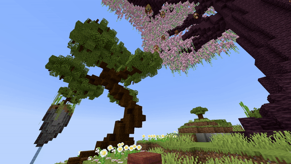

<DocHeading
icon="mdi:fountain"
title="Fountain"
description="Emits falling blocks for a specified amount of time.">
</DocHeading>
## Parameters

| Parameter      | Description                                                                                                                                                        | Example                    |
|----------------|--------------------------------------------------------------------------------------------------------------------------------------------------------------------|----------------------------|
| **Location**   | The origin of the fountain, formatted as `world, x, y, z`.                                                                                                         | `world, 196.3, 64, -381.8` |
| **Velocity**   | Sets the velocity of the falling blocks to launch them in a specific direction. Keep values reasonable (around a max of 10). Format is `x, y, z`.                  | `1, 1.5, 0`                |
| **Block**      | The [Minecraft block](https://hub.spigotmc.org/javadocs/bukkit/org/bukkit/Material.html) used as the falling block. Items are not supported.                       | `BLUE_STAINED_GLASS`       | 
| **BlockData**  | Optional block state data (e.g., open gate, rotated stair). Use `[]` for none. See [block states](https://minecraft.wiki/w/Block_states) for details.              | `[open=true]`              |
| **Duration**   | The length of time the effect runs, measured in ticks (1 tick = 1/20 second).                                                                                      | `20`                       |
| **Randomizer** | Adds random variation to the velocity. Values between `0` and `1` are recommended for natural effects.                                                             | `0.5`                      |
| **Delay**      | Number of ticks to wait after the show starts before activating the effect.                                                                                        | `40`                       |

<details>
<summary>YML Preset</summary>

```yaml
'1':
  Type: FOUNTAIN
  Location: world, 0, 0, 0
  Velocity: 0, 0, 0
  Block: BLUE_STAINED_GLASS
  BlockData: []
  Length: 20
  Randomizer: 0
  Delay: 0
```

</details>

---

## Preview



---

## Youtube Tutorial

<iframe width="560" height="315" src="https://www.youtube.com/embed/0s7TxjkW2nE" title="YouTube video player" frameborder="0" allowfullscreen></iframe>
