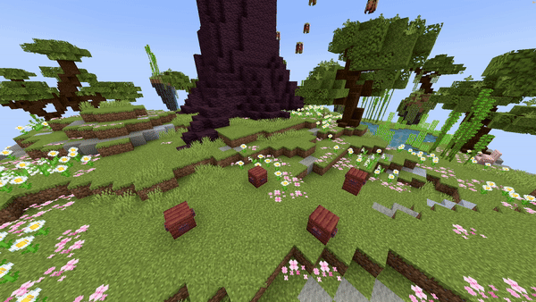

# Item Fountain Path

## Parameters

| Parameter           | Description                                                                                                                                                                                                                                                                                                                                   | Example                                                          |
|---------------------|-----------------------------------------------------------------------------------------------------------------------------------------------------------------------------------------------------------------------------------------------------------------------------------------------------------------------------------------------|------------------------------------------------------------------|
| **Path**            | The path the origin of the fountain follows, formatted as `world, x1, y1, z1; x2, y2, z2; x3, y3, z3`. You can add as many points as you like. **Separate locations with a semicolon (`;`).**                                                                                                                                                 | `world, 196.3, 64, -381.8; 199.3, 65, -375.8; 205.8, 61, -361.8` |
| **Velocity**        | Sets the velocity of the dropped items to launch them in a specific direction. Keep values reasonable (around a max of 10). Format is `x, y, z`.                                                                                                                                                                                              | `1, 1.5, 0`                                                      |
| **Material**        | The [Minecraft material](https://hub.spigotmc.org/javadocs/bukkit/org/bukkit/Material.html) used as the item. All items are supported here!                                                                                                                                                                                                   | `BLUE_STAINED_GLASS`                                             |
| **CustomModelData** | The [custom model data](https://mcmodels.net/how-to-tutorials/resource-pack-tutorials/what-is-custommodeldata-2/) ID of the item, used for custom textures or models.                                                                                                                                                                         | `12`                                                             |
| **Lifetime**        | How long the dropped items remain visible, in ticks (1 tick = 1/20 second). After this, they are removed.                                                                                                                                                                                                                                     | `40`                                                             |
| **Randomizer**      | Adds random variation to the velocity. Recommended values are between `0` and `1` for natural movement.                                                                                                                                                                                                                                       | `0.5`                                                            |
| **Speed**           | The speed at which the origin moves along the path, measured in blocks per second (`blocks/s`).                                                                                                                                                                                                                                               | `5`                                                              |
| **Frequency**       | Controls how many entities/particles spawn per block to avoid gaps when speed is high. The effect activates only if speed causes fewer entities per block than this value.                                                                                                                                                                    | `5`                                                              |
| **SplineType**      | The spline type which will be used for the path. This can be `POLY_CHAIN` for straight lines, `BEZIER` for extremely smooth lines which don't go over the exact points or `CATMULL_ROM` for smooth lines which do go over the points.                                                                                                         | `CATMULL_ROM`                                                    |
| **Delay**           | Number of ticks to wait after the show starts before activating the effect.                                                                                                                                                                                                                                                                   | `40`                                                             |

> **Frequency extra info:**  
> In Minecraft, entities or particles normally spawn once every tick. When speed is high, gaps can appear because fewer entities are spawned per block. The frequency parameter controls how many entities/particles should spawn per block to fill these gaps.  
> For example, a particle line moving 10 blocks per second with frequency 5 will spawn additional particles to prevent gaps, while at 1 block per second it won’t activate since normal spawn rate exceeds frequency.

<details>
<summary>YML Preset</summary>

```yaml
'1':
  Type: ITEM_FOUNTAIN_PATH
  Path: 'world, 0, 0, 0; 3, 3, 3'
  Velocity: 0, 1, 0
  Material: BLUE_STAINED_GLASS
  CustomModelData: 0
  Lifetime: 40
  Randomizer: 0
  Speed: 1
  Frequency: 5
  Smooth: true
  Delay: 0
```

</details>

---

## Preview



---

## Youtube Tutorial

*WIP*

