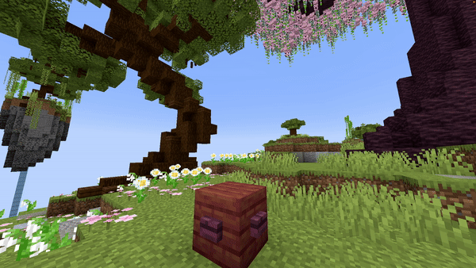

# Item Fountain

## Parameters

| Parameter           | Description                                                                                                                                                        | Example                    |
|---------------------|--------------------------------------------------------------------------------------------------------------------------------------------------------------------|----------------------------|
| **Location**        | The origin of the fountain in the format `world, x, y, z`.                                                                                                         | `world, 196.3, 64, -381.8` |
| **Velocity**        | Sets the velocity of the dropped items to launch them in a specific direction. Keep values reasonable (around a maximum of 10). Format is `x, y, z`.               | `1, 1.5, 0`                |
| **Material**        | The [Minecraft material](https://hub.spigotmc.org/javadocs/bukkit/org/bukkit/Material.html) to use as the item. All items are supported!                           | `DIAMOND_SWORD`            |
| **CustomModelData** | The [custom model data](https://mcmodels.net/how-to-tutorials/resource-pack-tutorials/what-is-custommodeldata-2/) of the item, used for custom models or textures. | `12`                       |
| **Duration**        | The duration of the effect in ticks (1 tick = 1/20 second).                                                                                                        | `20`                       |
| **Lifetime**        | How long the dropped items remain visible, in ticks. After this time, they are removed.                                                                            | `40`                       |
| **Randomizer**      | Adds random variation to the velocity. Values between `0` and `1` are recommended for natural movement.                                                            | `0.5`                      |
| **Delay**           | Number of ticks to wait after the show starts before activating the effect.                                                                                        | `40`                       |

<details>
<summary>YML Preset</summary>

```yaml
'1':
  Type: ITEM_FOUNTAIN
  Location: world, 0, 0, 0
  Velocity: 0, 0, 0
  Material: BLUE_STAINED_GLASS
  CustomModelData: 0
  Length: 20
  Lifetime: 40
  Randomizer: 0
  Delay: 0
```

</details>

---

## Preview



---

## Youtube Tutorial

Doesn't exist yet...

