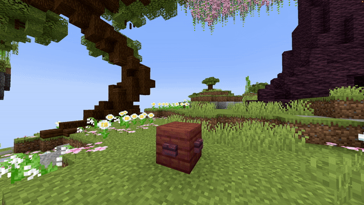

# Particle Emitter

| Parameter    | Information                                                                                                                                   | Example                    |
|--------------|-----------------------------------------------------------------------------------------------------------------------------------------------|----------------------------|
| **Location** | The location of the particle in the format `world, x, y, z`.                                                                                  | `world, 196.3, 64, -381.8` |
| **Particle** | The particle to spawn. See [Bukkit Particle List](https://hub.spigotmc.org/javadocs/spigot/org/bukkit/Particle.html) for available particles. | `FLAME`                    |
| **Amount**   | The number of particles to spawn each tick.                                                                                                   | `200`                      |
| **dX**       | The spread or delta along the X-axis where particles can spawn.                                                                               | `1`                        |
| **dY**       | The spread or delta along the Y-axis where particles can spawn.                                                                               | `1`                        |
| **dZ**       | The spread or delta along the Z-axis where particles can spawn.                                                                               | `1`                        |
| **Force**    | If `true`, particles are visible to players regardless of distance (if in view).                                                              | `false`                    |
| **Length**   | Duration of the effect in ticks.                                                                                                              | `40`                       |
| **StartUp**  | Time in ticks it takes to reach the full amount of particles. Set to `0` to disable this gradual start.                                       | `20`                       |
| **Size**     | Size of the particle (only works for `REDSTONE`, `SPELL_MOB`, and `SPELL_MOB_AMBIENT`).                                                       | `1.0`                      |
| **Color**    | RGB color of the particle (only for `REDSTONE`, `SPELL_MOB`, and `SPELL_MOB_AMBIENT`). Format: `R, G, B`.                                     | `123, 186, 92`             |
| **Block**    | Block material for particles that require a block type (`BLOCK_CRACK`, `BLOCK_DUST`, `FALLING_DUST`, `ITEM_CRACK`).                           | `STONE`                    |
| **Delay**    | Ticks to wait after the show starts before activating the effect.                                                                             | `40`                       |

<details>
<summary>YML Preset</summary>

```yaml
'1':
  Type: PARTICLE_EMITTER
  Location: world, 0, 0, 0
  Particle: SMOKE_NORMAL
  Amount: 1
  dX: 1
  dY: 1
  dZ: 1
  Force: false
  Length: 20
  StartUp: 0
  Delay: 0
```

</details>

---

## Preview



---

## Youtube Tutorial

Still needs to be made...
