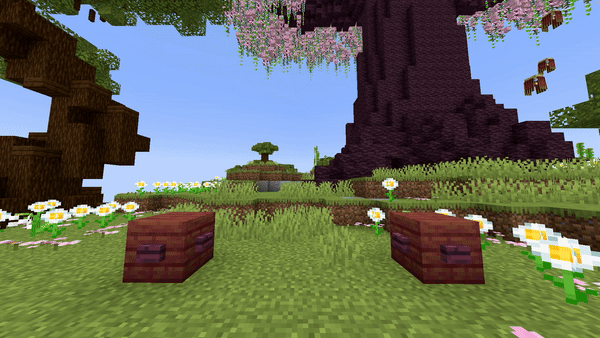

<DocHeading
icon="fluent:sparkle-action-16-filled"
title="Particle Line"
description="Spawns particles following a line from one location straight to another.">
</DocHeading>

## Parameters

| Parameter        | Description                                                                                                                                                                                                                                                                                 | Example                      |
|------------------|---------------------------------------------------------------------------------------------------------------------------------------------------------------------------------------------------------------------------------------------------------------------------------------------|------------------------------|
| **FromLocation** | The start location of the particles in the format `world, x, y, z`.                                                                                                                                                                                                                         | `world, 196.3, 64, -381.8`   |
| **ToLocation**   | The end location of the particles in the format `world, x, y, z`.                                                                                                                                                                                                                           | `world, 199.3, 62, -388.8`   |
| **Particle**     | The particle to spawn. See the [Bukkit Particle List](https://hub.spigotmc.org/javadocs/spigot/org/bukkit/Particle.html) for available particles.                                                                                                                                           | `FLAME`                      |
| **Amount**       | The number of particles to spawn.                                                                                                                                                                                                                                                           | `200`                        |
| **Speed**        | The speed at which the origin moves from the start location to the end location, measured in blocks per second.                                                                                                                                                                             | `3`                          |
| **Frequency**    | Minecraft spawns new entities or particles every tick. When speed is very high, gaps may appear between particles. This parameter defines how many particles should spawn per block to avoid gaps. This effect only activates if the default particle density is lower than this frequency. | `5`                          |
| **Delta**        | Spread along the X, Y and Z where the particles can randomly appear.                                                                                                                                                                                                                        | `0, 0.5, 0.3`                |
| **Force**        | If `true`, particles are visible to players regardless of distance (if in their view).                                                                                                                                                                                                      | `false`                      |
| **Size**         | Size of the particle (only works for `REDSTONE`, `SPELL_MOB`, and `SPELL_MOB_AMBIENT`).                                                                                                                                                                                                     | `1.0`                        |
| **Color**        | RGB color of the particle (only for `REDSTONE`, `SPELL_MOB`, and `SPELL_MOB_AMBIENT`). Format: `R, G, B`.                                                                                                                                                                                   | `123, 186, 92`               |
| **Block**        | Block material for particles that require a block type (`BLOCK_CRACK`, `BLOCK_DUST`, `FALLING_DUST`, `ITEM_CRACK`).                                                                                                                                                                         | `STONE`                      |
| **Delay**        | Number of ticks to wait after the show starts before the effect activates.                                                                                                                                                                                                                  | `40`                         |

> ### Frequency Extra Info
> Minecraft spawns new entities or particles every tick. When speed is very high, empty spaces can appear between particles. The frequency parameter specifies how many particles should spawn per block to fill these gaps.
>
> This activates only if the default particle density is lower than the frequency.
>
> **Example:**  
> A particle line travels 10 blocks at a speed of 1 block/second with a frequency of 5:  
> - 1 block/s means 20 ticks per block → 20 particles/block (since 1 particle per tick)  
> - 20 > 5, so frequency does **not** activate.  
>  
> If speed is increased to 10 blocks/second:  
> - 10 blocks/s means 2 particles per block → 2 < 5, so frequency activates to spawn extra particles.

<details>
<summary>YML Preset</summary>

```yaml
'1':
  Type: PARTICLE_LINE
  FromLocation: world, 0, 0, 0
  ToLocation: world, 0, 3, 0
  Particle: SMOKE_NORMAL
  Amount: 1
  Speed: 1
  Frequency: 5
  dX: 0
  dY: 0
  dZ: 0
  Force: false
  Delay: 0
```

</details>

---

## Preview



---

## Youtube Tutorial

On my to do list...
