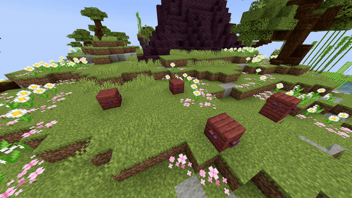

<DocHeading
icon="fluent:arrow-trending-sparkle-24-filled"
title="Particle Path"
description="Spawns particles following a specified path.">
</DocHeading>

## Parameters

| Parameter      | Description                                                                                                                                                                                                                                                       | Example                                                          |
|----------------|-------------------------------------------------------------------------------------------------------------------------------------------------------------------------------------------------------------------------------------------------------------------|------------------------------------------------------------------|
| **Path**       | The path the particles follow using the format: <br />`world, x1, y1, z1; x2, y2, z2; x3, y3, z3`. <br />Use a semicolon (`;`) to separate different locations.                                                                                                   | `world, 196.3, 64, -381.8; 199.3, 65, -375.8; 205.8, 61, -361.8` |
| **Particle**   | The particle to spawn. See the [Bukkit Particle List](https://hub.spigotmc.org/javadocs/spigot/org/bukkit/Particle.html) for all particles.                                                                                                                       | `FLAME`                                                          |
| **Amount**     | The number of particles to spawn.                                                                                                                                                                                                                                 | `200`                                                            |
| **Speed**      | The speed at which the origin moves along the path, measured in blocks per second.                                                                                                                                                                                | `3`                                                              |
| **Frequency**  | Minecraft spawns new entities or particles every tick. When speed is very high, gaps may appear between particles. This parameter sets how many particles should spawn per block to fill gaps. Activates only if the default density is lower than the frequency. | `5`                                                              |
| **dX**         | Spread on the X-axis over which the particle can spawn.                                                                                                                                                                                                           | `1`                                                              |
| **dY**         | Spread on the Y-axis over which the particle can spawn.                                                                                                                                                                                                           | `1`                                                              |
| **dZ**         | Spread on the Z-axis over which the particle can spawn.                                                                                                                                                                                                           | `1`                                                              |
| **Force**      | If `true`, particles are visible to players regardless of distance (if in their view).                                                                                                                                                                            | `false`                                                          |
| **SplineType** | The spline type which will be used for the path. This can be `POLY_CHAIN` for straight lines, `BEZIER` for extremely smooth lines which don't go over the exact points or `CATMULL_ROM` for smooth lines which do go over the points.                             | `CATMULL_ROM`                                                    |
| **Size**       | Particle size, only works for `REDSTONE`, `SPELL_MOB`, and `SPELL_MOB_AMBIENT`.                                                                                                                                                                                   | `1.0`                                                            |
| **Color**      | RGB color of the particle, only for `REDSTONE`, `SPELL_MOB`, and `SPELL_MOB_AMBIENT`. Format: `R, G, B`.                                                                                                                                                          | `123, 186, 92`                                                   |
| **Block**      | Block material for particles that require it (`BLOCK_CRACK`, `BLOCK_DUST`, `FALLING_DUST`, `ITEM_CRACK`).                                                                                                                                                         | `STONE`                                                          |
| **Delay**      | Ticks to wait after the show starts before the effect activates.                                                                                                                                                                                                  | `40`                                                             |

> ### Frequency Extra Info
> Minecraft spawns new entities or particles every tick. When speed is very high, empty spaces can appear between particles. The frequency parameter specifies how many particles should spawn per block to fill these gaps.
>
> This activates only if the default particle density is lower than the frequency.
>
> **Example:**  
> A particle line travels 10 blocks at a speed of 1 block/second with a frequency of 5:  
> - 1 block/s means 20 ticks per block → 20 particles/block (since 1 particle per tick)  
> - 20 > 5, so frequency does **not** activate.  
>  
> If speed is increased to 10 blocks/second:  
> - 10 blocks/s means 2 particles per block → 2 < 5, so frequency activates to spawn extra particles.

<details>
<summary>YML Preset</summary>

```yaml
'1':
  Type: PARTICLE_PATH
  Path: 'world, 0, 0, 0; 0, 0, 0'
  Particle: SMOKE_NORMAL
  Amount: 1
  Speed: 1
  Frequency: 5
  dX: 0
  dY: 0
  dZ: 0
  Force: false
  Smooth: true
  Delay: 0
```

</details>

---

## Preview



---

## Youtube Tutorial

Uhh, later...
