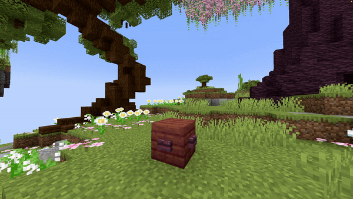

# Particle

| Parameter    | Information                                                                                                                                           | Example                    |
|--------------|-------------------------------------------------------------------------------------------------------------------------------------------------------|----------------------------|
| **Location** | The spawn location of the particle, in the format: <br />`world, x, y, z`                                                                             | `world, 196.3, 64, -381.8` |
| **Particle** | The particle to spawn. See the [Bukkit Particle List](https://hub.spigotmc.org/javadocs/spigot/org/bukkit/Particle.html) for all available particles. | `CLOUD`                    |
| **Amount**   | Number of particles to spawn.                                                                                                                         | `50`                       |
| **dX**       | Spread along the X-axis where the particles can randomly appear.                                                                                      | `1`                        |
| **dY**       | Spread along the Y-axis where the particles can randomly appear.                                                                                      | `1`                        |
| **dZ**       | Spread along the Z-axis where the particles can randomly appear.                                                                                      | `1`                        |
| **Force**    | If `true`, players will see the particle regardless of distance (if in their field of view).                                                          | `false`                    |
| **Size**     | Size of the particle; works only for `REDSTONE`, `SPELL_MOB`, and `SPELL_MOB_AMBIENT`.                                                                | `1.0`                      |
| **Color**    | RGB color of the particle, only for `REDSTONE`, `SPELL_MOB`, and `SPELL_MOB_AMBIENT`. Format: `R, G, B`.                                              | `123, 186, 92`             |
| **Block**    | Block material for particles requiring it (`BLOCK_CRACK`, `BLOCK_DUST`, `FALLING_DUST`, `ITEM_CRACK`).                                                | `STONE`                    |
| **Delay**    | Number of ticks to wait after the show starts before spawning the particles.                                                                          | `40`                       |

<details>
<summary>YML Preset</summary>

```yaml
'1':
  Type: PARTICLE
  Location: world, 0, 0, 0
  Particle: SMOKE_NORMAL
  Amount: 1
  dX: 1
  dY: 1
  dZ: 1
  Force: false
  Delay: 0
```

</details>

---

## Preview



---

## Youtube Tutorial

Doesn't exist yet...
