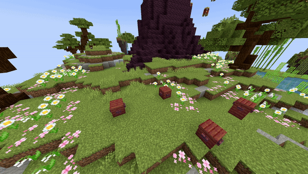

# Replace Fill

| Parameter         | Information                                                                                                                                                                                          | Example                 |
|-------------------|------------------------------------------------------------------------------------------------------------------------------------------------------------------------------------------------------|-------------------------|
| **FromLocation**  | The first corner location of the area to replace blocks in, similar to the first position in the [Minecraft /fill command](https://minecraft.wiki/w/Commands/fill). Format: <br />`world, x, y, z`   | `world, 196, 64, -381`  |
| **ToLocation**    | The second corner location of the area to replace blocks in, similar to the second position in the [Minecraft /fill command](https://minecraft.wiki/w/Commands/fill). Format: <br />`world, x, y, z` | `world, 196, 64, -381`  |
| **Block**         | The block to place temporarily. Must be a valid [Bukkit block material](https://hub.spigotmc.org/javadocs/bukkit/org/bukkit/Material.html). Items do not work.                                       | `STONE`                 |
| **BlockData**     | Optional block state data, e.g., for open gates or rotated stairs. Use `[]` if none. See [Minecraft block states](https://minecraft.wiki/w/Block_states).                                            | `[open=true]`           |
| **Replacing**     | The block type that will be replaced by the temporary block. Must be a valid Bukkit material.                                                                                                        | `COBBLESTONE`           |
| **Duration**      | Duration in ticks for how long the block replacement remains active before reverting back.                                                                                                           | `100`                   |
| **Delay**         | Ticks to wait after the show starts before activating the effect.                                                                                                                                    | `40`                    |

<details>
<summary>YML Preset</summary>

```yaml
'1':
  Type: REPLACE_FILL
  FromLocation: world, 0, 0, 0
  ToLocation: world, 3, 3, 3
  Block: STONE
  BlockData: []
  Replacing: COBBLESTONE
  Duration: 100
  Delay: 0
```

</details>

---

## Preview



---

## Youtube Tutorial

This effect isn't that complex, you have enough info with this page right? right...?