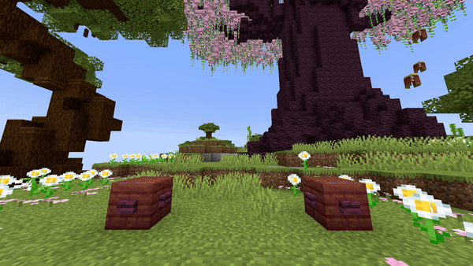

<DocHeading
icon="fa6-solid:bucket"
title="Fill Block"
description="Sets all the blocks in a cubic area to the specified material.">
</DocHeading>

## Parameters

| Parameter        | Description                                                                                                                                                   | Example                |
|------------------|---------------------------------------------------------------------------------------------------------------------------------------------------------------|------------------------|
| **FromLocation** | The first location, comparable with the first location of the [ /fill](https://minecraft.wiki/w/Commands/fill) command. Format: `world, x, y, z`.             | `world, 196, 64, -381` |
| **ToLocation**   | The second location, comparable with the second location of the [ /fill](https://minecraft.wiki/w/Commands/fill) command. Format: `world, x, y, z`.           | `world, 215, 70, -390` |
| **Block**        | The [block](https://hub.spigotmc.org/javadocs/bukkit/org/bukkit/Material.html) to use. Items will not work!                                                   | `STONE`                |
| **BlockData**    | The [block data](https://minecraft.wiki/w/Block_states) of the block (if it has any). Examples: an open gate, a rotated stair, etc. Use `[]` to specify none. | `[open=true]`          |
| **Duration**     | The amount of time (in ticks) this change stays active before reverting back to normal.                                                                       | `60`                   |
| **Delay**        | The amount of ticks this effect waits after the show starts before activation.                                                                                | `40`                   |

> **Important Notice**
> The blocks used for the fill effect are **not real blocks**, but are sent to players as packets.
> This means:
>
> 1. Players cannot interact with these blocks — if they do, the blocks revert to their original state.
> 2. Large block changes are avoided for performance and safety reasons (e.g., accidental huge fills).
> 3. This plugin is designed for visual effects, **not** for world terraforming or permanent changes.

<details>
<summary>YAML Preset</summary>

```yaml
'1':
Type: FILL_BLOCK
FromLocation: world, 0, 0, 0
ToLocation: world, 3, 3, 3
Block: STONE
BlockData: []
Duration: 100
Delay: 0
```

</details>

## Preview



## Youtube Tutorial

Soon... hopefully heheh
