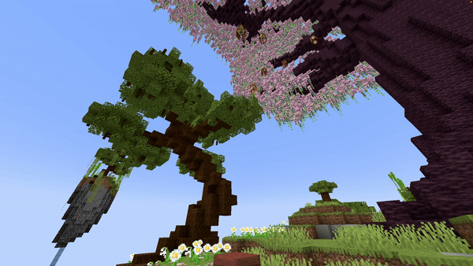

<DocHeading
icon="streamline:fireworks-rocket"
title="Firework"
description="Spawns a customizable firework rocket.">
</DocHeading>

## Parameters

| Parameter          | Description                                                                                                                                                                                                  | Example                     |
|--------------------|--------------------------------------------------------------------------------------------------------------------------------------------------------------------------------------------------------------|-----------------------------|
| **Location**       | The location to spawn the firework in the format `world, x, y, z`.                                                                                                                                           | `world, 196.3, 64, -381.8`  |
| **Velocity**       | Sets the velocity of the firework, used to launch it in a direction. If `ShotAtAngle` is `false`, it will eventually go upward automatically. Use `0, 0, 0` for a normal firework launch. Format: `x, y, z`. | `0.5, 1.3, 0`               |
| **Colors**         | The colors the firework will display, formatted as a list of hex colors, e.g. `#ffffff, #000000`.                                                                                                            | `#ffffff, #000000`          |
| **FadeColors**     | The fade colors of the firework, same format as `Colors`. Leave empty (`' '`) for no fade colors.                                                                                                            | `#ffffff, #000000, #cccccc` |
| **Power**          | The firework power, from `0` to `127`. Use `-1` for instant explosion.                                                                                                                                       | `2`                         |
| **FireworkShape**  | Shape of the firework explosion. Possible values: `BALL`, `BALL_LARGE`, `BURST`, `CREEPER`, or `STAR`.                                                                                                       | `BALL`                      |
| **ShotAtAngle**    | If `true`, the firework will fly straight like launched from a dispenser or crossbow; you must set `Velocity` to control direction. Values: `true` or `false`.                                               | `false`                     |
| **Flicker**        | Whether the explosion flickers (`true` or `false`).                                                                                                                                                          | `true`                      |
| **Trail**          | Whether the explosion leaves a trail (`true` or `false`).                                                                                                                                                    | `true`                      |
| **Delay**          | Number of ticks the effect waits after the show starts before activating.                                                                                                                                    | `40`                        |

<details>
<summary>YML Preset</summary>

```yaml
'1':
Type: FIREWORK
Location: world, 0, 0, 0
Velocity: 0, 0, 0
Colors: '#ffffff, #000000'
FadeColors: ' '
Power: 2
FireworkShape: BALL
ShotAtAngle: false
Flicker: false
Trail: false
Delay: 0
```

</details>

## Preview



## Youtube Tutorial

Work in progress... :)
