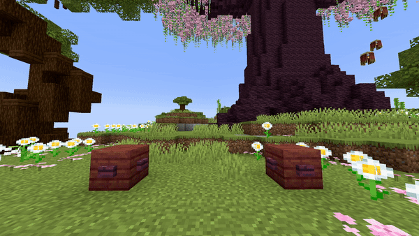

<DocHeading
icon="fa6-solid:cubes-stacked"
title="Item Fountain Line"
description="The same as the Fountain Line effect, but with dropped items instead.">
</DocHeading>

## Parameters

| Parameter           | Description                                                                                                                                                                               | Example                    |
|---------------------|-------------------------------------------------------------------------------------------------------------------------------------------------------------------------------------------|----------------------------|
| **FromLocation**    | The start location of the fountain in the format of `world, x, y, z`.                                                                                                                     | `world, 196.3, 64, -381.8` |
| **ToLocation**      | The location it moves towards in the format of `world, x, y, z`.                                                                                                                          | `world, 201.3, 64, -381.8` |
| **Velocity**        | Sets the velocity of the dropped items. This is used to launch items in a specific direction. Avoid setting these values too high (recommended max \~10). Follows the pattern `x, y, z`.  | `1, 1.5, 0`                |
| **Material**        | The [material](https://hub.spigotmc.org/javadocs/bukkit/org/bukkit/Material.html) to use as item. All items work here!                                                                    | `NETHER_STAR`              |
| **CustomModelData** | The [custom model data](https://mcmodels.net/how-to-tutorials/resource-pack-tutorials/what-is-custommodeldata-2/) of the item (if you want to use custom models).                         | `12`                       |
| **Lifetime**        | The amount of time (in ticks) the dropped items should stay visible. After this time, they will be removed.                                                                               | `40`                       |
| **Randomizer**      | Randomizes the velocity values slightly. Higher values cause more velocity variation. Suggested range is between `0` and `1`.                                                             | `0.5`                      |
| **Speed**           | The speed at which the origin moves from the start location to the end location. Measured in `blocks/s`.                                                                                  | `5`                        |
| **Frequency**       | Controls how many entities or particles spawn per block to avoid gaps when speed is high. The effect activates only if the number of entities per block is less than the frequency value. | `5`                        |
| **Delay**           | The amount of ticks this effect waits after the show starts before its activation.                                                                                                        | `40`                       |

> **Frequency extra info**
> In Minecraft, new entities or particles spawn every tick. At high speeds, gaps appear between entities or particles. The frequency parameter ensures a minimum number of entities/particles per block, filling these gaps.
>
> For example:
>
> * Speed = 1 block/s, frequency = 5 → Frequency not activated because \~20 particles spawn per block (higher than 5).
> * Speed = 10 blocks/s, frequency = 5 → Only \~2 particles per block spawn, so frequency activates to add more particles and fill gaps.

<details>
<summary>YAML Preset</summary>

```yaml
'1':
Type: ITEM_FOUNTAIN_LINE
FromLocation: world, 0, 0, 0
ToLocation: world, 0, 3, 0
Velocity: 0, 0, 0
Material: BLUE_STAINED_GLASS
CustomModelData: 0
Lifetime: 40
Randomizer: 0
Speed: 1
Frequency: 5
Delay: 0
```

</details>

## Preview



## Youtube Tutorial

Not yet...
