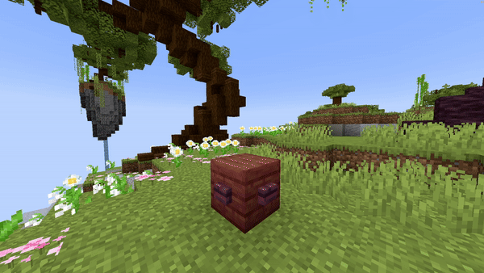

<DocHeading
icon="mdi:cube"
title="Set Block"
description="Sets a block on a location for a specified amount of time.">
</DocHeading>

## Parameters

| Parameter     | Description                                                                                                                                                 | Example                |
|---------------|-------------------------------------------------------------------------------------------------------------------------------------------------------------|------------------------|
| **Location**  | The location of the block to set. Format: <br />`world, x, y, z`                                                                                            | `world, 196, 64, -381` |
| **Block**     | The block material to set, must be a valid [Bukkit block material](https://hub.spigotmc.org/javadocs/bukkit/org/bukkit/Material.html). Items will not work. | `STONE`                |
| **BlockData** | Optional block state data, such as open gates or rotated stairs. Use `[]` if none. See [Minecraft block states](https://minecraft.wiki/w/Block_states).     | `[]`                   |
| **Duration**  | Duration in ticks for how long the block stays set before reverting.                                                                                        | `100`                  |
| **Real**      | Whether to spawn a real block or not. If `true`, the block cannot be displayed privately in private shows.                                                  | `false`                |
| **Delay**     | Number of ticks to wait after the show starts before activating the effect.                                                                                 | `40`                   |

<details>
<summary>YML Preset</summary>

```yaml
'1':
  Type: SET_BLOCK
  Location: world, 0, 0, 0
  Block: STONE
  BlockData: []
  Duration: 100
  Delay: 0
  Real: false
```

</details>

---

## Preview



---

## Youtube Tutorial

Just uhh, use this wiki... :)
